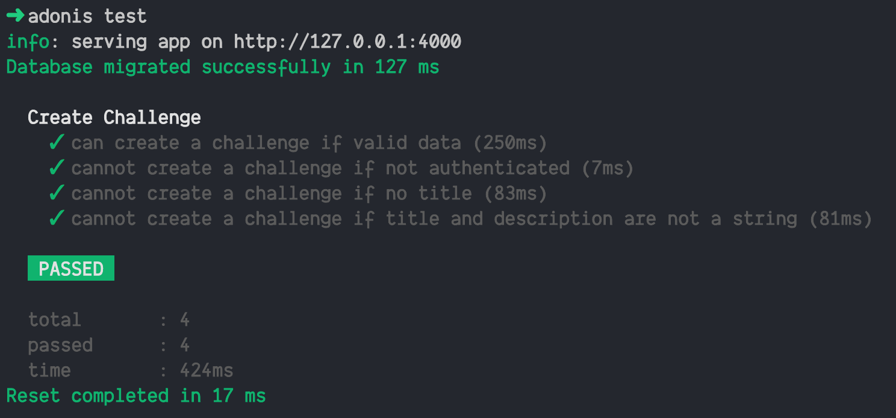
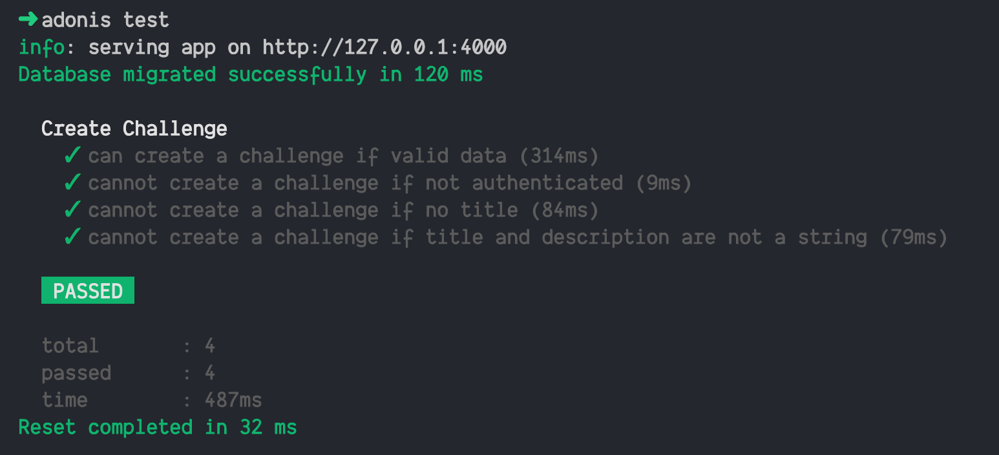
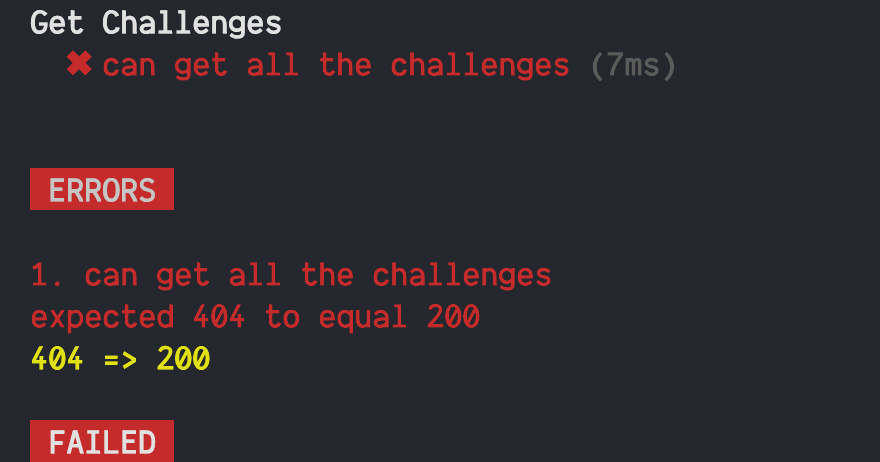
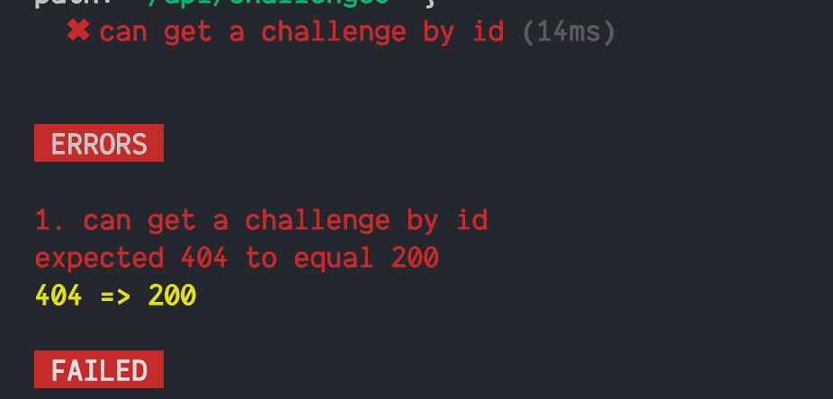
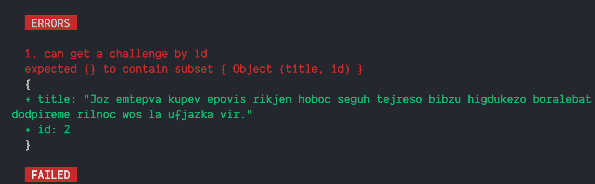

- [Part 1](https://equimper.com/blog/build-a-rest-api-with-adonisjs-and-tdd-part-1)
- [Part 3](https://equimper.com/blog/build-a-rest-api-with-adonisjs-and-tdd-part-3)
- [Source Code](https://github.com/EQuimper/adonis-tdd-tutorial-demo)

## Intro

Been a long time since [part 1](https://equimper.com/blog/build-a-rest-api-with-adonisjs-and-tdd-part-1), sorry about that.

In this part, we will continue our Movies rest API with TDD. We will go a bit faster cause we now know the step we need to make in order to follow the TDD approach.

```
Fail -> Pass -> Refactor
```

## Quick Fixes

In the last part, we make use, in testing env, of the DB postgres. Nothing bad with that, it's ok to use it. But I think will be faster in the long run if we make use of SQLite.

Don't worry again Adonis have made it easy for us :)

First, run

```
npm i -D sqlite3
```

This will install the drive we need for SQLite as a Dev Dependencies.

Now go inside your .env.testing file and put those lines

```
DB_CONNECTION=sqlite
DB_HOST=127.0.0.1
DB_PORT=3306
DB_USER=root
DB_PASSWORD=
DB_DATABASE=movies_challenges_test
```

Don't forget to remove the other one who touches the db.

Now if you rerun the test with `adonis test` you should see all test pass



If you compare this to before you can see we get a bit faster. This will get faster more and more test we will add. SQLite is a in-memory db.



## Get /api/challenges

Here, as the title says, we will work on the GET request who gonna give us all the challenges in our API. For now and for the purpose of the tutorial, we don't gonna worry about the pagination, etc.

```
adonis make:test GetChallenges
```

And choose Functional test

Go to the new file

```
test/functional/get-challenges.spec.js
```

Like in the past test file we need to import the Factory and get the trait

```js
'use strict'

const Factory = use('Factory')
const { test, trait } = use('Test/Suite')('Get Challenges')

trait('Test/ApiClient')
trait('Auth/Client')

test('make sure 2 + 2 is 4', async ({ assert, client }) => {
  assert.equal(2 + 2, 4)
})
```

Time to write the first test. First, what do we want to achieve here? For this endpoints, we want to make sure we can get all the challenges we have to save inside the database. This will be quite simple here.

```js
'use strict'

const Factory = use('Factory')
const { test, trait } = use('Test/Suite')('Get Challenges')

trait('Test/ApiClient')
trait('Auth/Client')

test('can get all the challenges', async ({ assert, client }) => {
  const challenges = await Factory.model('App/Models/Challenge').createMany(3)

  const response = await client.get('/api/challenges').end()

  response.assertStatus(200)

  response.assertJSONSubset([
    { title: challenges[0].title },
    { title: challenges[1].title },
    { title: challenges[2].title },
  ])
})
```

Here we first create 3 challenges by using the createMany method on Factory. After we check the response status equal 200 and also the JSON response have all 3 titles inside the return array.



If you run the test this is what you see.

Make sense we didn't create the route yet. Go to the route file and add

```js
Route.get('/api/challenges', 'ChallengeController.all')
```

Now if you add this line to your test file

```js
console.log('error', response.error)
```

After the response promise resolve you will see.

```
'RuntimeException: E_UNDEFINED_METHOD: Method all missing on App/Controllers/Http/ChallengeController\n> More details: https://err.sh/adonisjs/errors/E_UNDEFINED_METHOD'
```

This is normal, we make use of a method in controller who do not exist.

Go inside your ChallengeController and add this method

```js
async all({ response, request }) {
  const challenges = await Challenge.all()

  return response.ok(challenges)
}
```

Now after running the test, all should be green :)

This call the all method from your Challenge model and this will return an array of all the challenge available. The response.ok will return a JSON object with the status `200 OK` :)

## Get /api/challenges/:id

Time to work on getting a single challenge by his id.

Pretty simple work again, just need to follow those step.

```cmd
adonis make:test GetChallenge
```

You can copy and paste the last test we create about to get all challenges this will look almost the same.

```js
'use strict'

const Factory = use('Factory')
const { test, trait } = use('Test/Suite')('Get Challenge')

trait('Test/ApiClient')
trait('Auth/Client')

test('can get a challenge by id', async ({ assert, client }) => {
  const challenges = await Factory.model('App/Models/Challenge').createMany(3)

  const challenge = challenges[0]

  const response = await client.get(`/api/challenges/${challenge.id}`).end()

  response.assertStatus(200)

  response.assertJSONSubset({ title: challenge.title, id: challenge.id })
})
```

A pretty simple one, we create 3 challenges just to make it a bit more realistic. We after that create a variable challenge who will be the first one in the array. We then add the id to the URL. In the end, we check for the status 200 and also the JSON will need to have both title and id who match this challenge.



Follow the same step we have made before, so go to routes and add the route for this one.

```js
Route.get('/api/challenges/:id', 'ChallengeController.show')
```

After this, your test will say we don't have the method in your controller. Time to add this

```js
async show({ response }) {
  return response.ok({})
}
```



The next error is important, is the one who checks if the return object matches what we supposed. It's pretty normal it failed here we return an empty object. So time to make it work.

```js
async show({ response, params }) {
  const challenge = await Challenge.find(params.id)

  return response.ok(challenge)
}
```

For getting access of the params id we make use of the params object and we then call find from the Challenge Model.

If you run all the test now all will be green.

But we need one more test for this endpoint. What will happen if the id do not exist?

If you try it this will fail. A pretty easy test to write

```js
test('status 404 if id do not exist', async ({ assert, client }) => {
  const response = await client.get('/api/challenges/999').end()

  response.assertStatus(404)
})
```

Does the error say 204 should equal 404? Umh strange, time to fix it.

```js
async show({ response, params }) {
  const challenge = await Challenge.findOrFail(params.id)

  return response.ok(challenge)
}
```

Yes, only one thing to change, findOrFail like the name says will return 404 if the object is not found :) Really nice and easy :)

Source code: https://github.com/EQuimper/adonis-tdd-tutorial-demo/tree/part-2

## End word

Hope you enjoy this one, not too much, but we start to understand the flow and see how TDD help us going faster on the implementation of the API.

In the next part, we will add a way for a user to get all of his challenges. And also a way to update and delete the challenge if you are the author.

Happy coding :)
